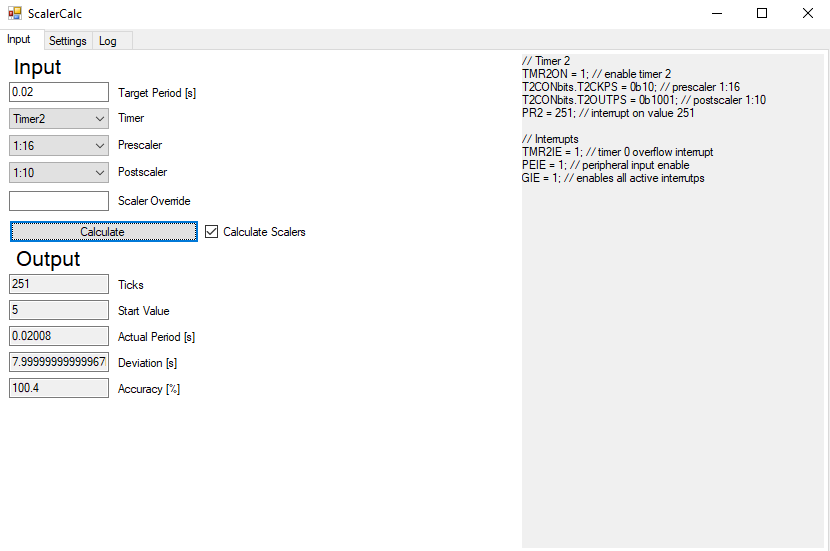
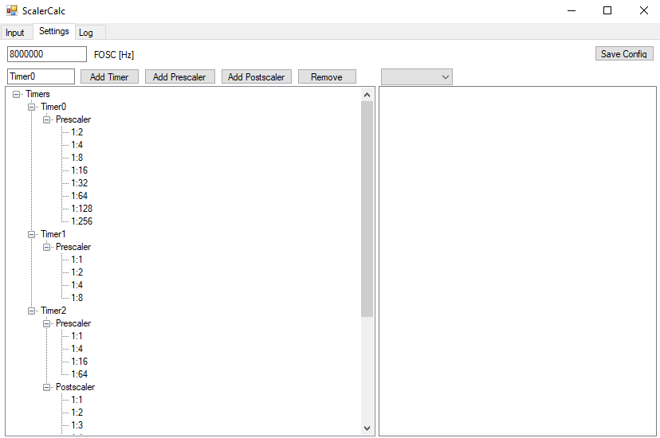

# cs-timerCalc
Calculates scalers and presets for 8 bit timers. Designed for PIC16F1787, but can be modified to work with other 8 bit timers as well.

## Quick Overview

Simply enter the desired interrupt delay, select a [predefined](settings) timer and hit 'Calculate'

You can use manually selected scalers by unchecking the "Calculate scaler" option; this can be useful if you need to provide different delays with the same scalers.
If the timer does not support such high delays, you can use Scaler Override and enter a custom scaler that you would implement as a variable that is incremented on interrupt. Note that when using Scaler Override, the prescaler and postscaler are processed as if they were set to 1:1

## Settings

The programme has been defined to be fully customisable. At the moment, the only limitation is that the timer size is limited to 8 bits, but this only affects the preload value

Note that you cannot add the scalers directly '1:1', they are added as soon as you add your first pre or post scaler
Your settings are being stored on your device when pressing 'Save Config'
Multiple Configs are not possible (except when having the programme installed at different locations)
Default Config works for PIC16F1787 already.

### Code Generator
You can add your own initialisation scripts, the following variables are known:

| Variable  | Definition | Example  |
| ------------- | ------------- | ------------- |
| $PRESCALER | the index of the selected prescaler as binary number | 0b10 (third item is selected) |
| $PRESCALER_NAME  | name of the prescaler as displayed in the dropdown | 1:8 |
| $POSTSCALER | the index of the selected postscaler as binary number | 0b01 (second item is selected) |
| $POSTSCALER_NAME  | name of the postscaler as displayed in the dropdown | 1:4 |
| $TICKS | amount of ticks required | 210 |
| $PRELOAD  | 255 - $TICKS, thus the preload value | 45 |
